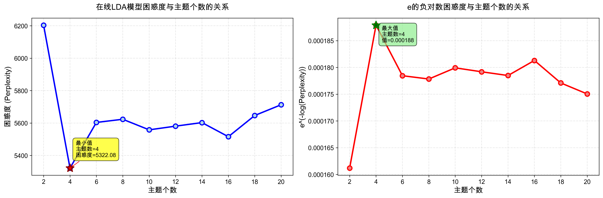
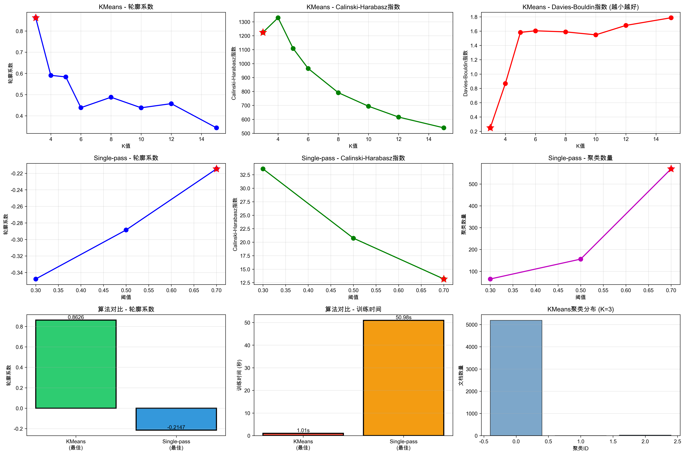

# 文本挖掘与聚类分析实验报告

## 目录

1. [项目概述](#项目概述)
2. [环境配置](#环境配置)
3. [数据说明](#数据说明)
4. [实验一：LDA主题模型困惑度分析](#实验一lda主题模型困惑度分析)
5. [实验二：文本聚类算法对比](#实验二文本聚类算法对比)
6. [实验结果与分析](#实验结果与分析)
7. [结论与建议](#结论与建议)
8. [文件说明](#文件说明)

---

## 项目概述

本项目针对日本台湾相关的中文新闻文本数据，开展了系统的文本挖掘和信息提取工作。主要包括两个核心实验：

1. **LDA主题模型分析**：使用在线LDA（Online LDA）算法，分析不同主题数量下的模型困惑度，确定最优主题个数
2. **聚类算法对比**：对比KMeans和Single-pass两种文本聚类算法的性能，选择最优算法进行信息挖掘

### 技术栈

- **编程语言**：Python 3.10
- **核心库**：
  - `scikit-learn`：机器学习算法
  - `pandas`：数据处理
  - `numpy`：数值计算
  - `scipy`：稀疏矩阵处理
  - `matplotlib`：数据可视化

---

## 环境配置

### 1. 创建虚拟环境

```bash
cd /path/to/algo
python3 -m venv venv
source venv/bin/activate  # Windows: venv\Scripts\activate
```

### 2. 安装依赖

```bash
pip install -r requirements.txt
```

`requirements.txt` 内容：
```
pandas>=1.3.0
numpy>=1.21.0
scikit-learn>=1.0.0
scipy>=1.8.0
matplotlib>=3.4.0
```

### 3. 验证安装

```bash
python -c "import sklearn; import pandas; import numpy; print('环境配置成功')"
```

---

## 数据说明

### 数据文件

- **文件名**：`cn_bow.csv`
- **格式**：CSV文件，包含日期、标签和词袋向量
- **数据规模**：
  - 文档数量：5,219篇
  - 词汇表大小：60,415个词
  - 矩阵稀疏度：99.84%

### 数据结构

| 列名 | 说明 | 示例 |
|------|------|------|
| date | 新闻发布日期时间 | 2025-12-01 22:59:00 |
| label | 新闻标签/分类 | 日本 台湾 |
| bow_vector | 词袋向量（稀疏表示） | 2198:1 20342:1 51241:1... |

**词袋向量格式**：`词ID:频次 词ID:频次 ...`
- 例如：`2198:1` 表示词ID为2198的词在该文档中出现1次

### 数据特点

- **高维稀疏**：60,415维特征空间，99.84%的元素为0
- **主题明确**：所有文档均与"日本 台湾"相关
- **时间范围**：2025年12月的新闻数据

---

## 实验一：LDA主题模型困惑度分析

### 实验目的

使用在线LDA（Online Latent Dirichlet Allocation）算法，探索不同主题数量下的模型性能，通过困惑度（Perplexity）指标确定最优主题个数。

### 方法介绍

#### 1. LDA（潜在狄利克雷分配）

LDA是一种无监督的概率主题模型，假设：
- 每个文档由多个主题的混合组成
- 每个主题由多个词的概率分布表示

**数学表示**：
- 文档-主题分布：θ ~ Dir(α)
- 主题-词分布：φ ~ Dir(β)
- 词生成：w ~ Multinomial(φ)

#### 2. 在线LDA（Online LDA）

相比传统的批量LDA，在线LDA具有以下优势：
- **内存效率高**：不需要一次性加载所有文档
- **速度快**：采用小批量随机梯度下降
- **适合大规模数据**：可以增量更新模型

**关键参数**：
```python
LatentDirichletAllocation(
    n_components=n_topics,      # 主题数量
    max_iter=10,                # 最大迭代次数
    learning_method='online',   # 在线学习
    learning_decay=0.7,         # 学习率衰减
    learning_offset=50.0,       # 学习率偏移
    batch_size=512,             # 批次大小
    random_state=42             # 随机种子
)
```

#### 3. 困惑度（Perplexity）

困惑度衡量模型对测试数据的预测能力：

**公式**：
```
Perplexity = exp(-log P(w|M) / N)
```
其中：
- P(w|M)：模型对词的联合概率
- N：总词数

**解释**：
- 困惑度越低，模型性能越好
- 本实验还计算了 e^(-log(Perplexity)) = 1/Perplexity

### 实验步骤

#### 步骤1：数据预处理

```python
# 解析词袋向量
def parse_bow_vector(bow_string):
    bow_dict = {}
    for item in bow_string.split():
        word_id, count = item.split(':')
        bow_dict[int(word_id)] = int(count)
    return bow_dict

# 构建稀疏矩阵
from scipy.sparse import lil_matrix
X = lil_matrix((n_docs, n_features), dtype=np.float32)
for i, bow_dict in enumerate(bow_vectors):
    for word_id, count in bow_dict.items():
        X[i, word_id_to_idx[word_id]] = count
X = X.tocsr()  # 转换为压缩稀疏行格式
```

#### 步骤2：主题数量范围选择

测试主题数：2, 4, 6, 8, 10, 12, 14, 16, 18, 20

#### 步骤3：模型训练与评估

```python
for n_topics in topic_range:
    olda = LatentDirichletAllocation(...)
    olda.fit(X)
    perplexity = olda.perplexity(X)
    exp_neg_log_perplexity = np.exp(-np.log(perplexity))
```

### 运行方法

```bash
cd /path/to/algo
source venv/bin/activate
python olda_perplexity_analysis.py
```

### 实验结果

#### 详细数据

| 主题个数 | 困惑度 | e^(-log(Perplexity)) | 训练时间(秒) |
|---------|--------|---------------------|-------------|
| 2 | 6203.90 | 0.000161 | 7.3 |
| **4** | **5322.08** | **0.000188** | 8.4 |
| 6 | 5603.79 | 0.000178 | 7.0 |
| 8 | 5623.30 | 0.000178 | 7.3 |
| 10 | 5558.07 | 0.000180 | 7.9 |
| 12 | 5580.89 | 0.000179 | 8.2 |
| 14 | 5602.75 | 0.000178 | 9.2 |
| 16 | 5515.78 | 0.000181 | 9.7 |
| 18 | 5646.67 | 0.000177 | 10.1 |
| 20 | 5712.90 | 0.000175 | 10.6 |

#### 可视化结果



**图表解读**：
- **左图**：困惑度随主题数的变化
  - 主题数从2增加到4时，困惑度急剧下降
  - 主题数为4时达到最低点（5322.08）
  - 之后趋于平稳，略有波动

- **右图**：e^(-log(Perplexity))随主题数的变化
  - 与困惑度呈反比关系
  - 主题数为4时达到峰值（0.000188）

#### 结论

- **最优主题个数**：4个主题
- **最低困惑度**：5322.08
- **最佳性能指标**：e^(-log(Perplexity)) = 0.000188

**解释**：数据可以被有效地分为4个主题类别，这在困惑度和模型复杂度之间达到了最佳平衡。

---

## 实验二：文本聚类算法对比

### 实验目的

对比KMeans和Single-pass两种经典文本聚类算法的性能，通过多维度评估指标选择最优算法进行后续信息挖掘工作。

### 方法介绍

#### 1. KMeans聚类算法

**原理**：
- 基于距离的划分聚类算法
- 目标：最小化簇内平方和（WCSS）
- 迭代优化聚类中心

**算法流程**：
```
1. 随机初始化K个聚类中心
2. 重复以下步骤直到收敛：
   a. 分配：将每个样本分配到最近的聚类中心
   b. 更新：重新计算每个簇的质心
3. 返回最终聚类结果
```

**优点**：
- 简单高效，易于理解
- 适合球形簇
- 聚类数量可控
- 收敛速度快

**缺点**：
- 需要预先指定K值
- 对初始值敏感
- 对异常值敏感

**关键参数**：
```python
KMeans(
    n_clusters=k,        # 聚类数量
    random_state=42,     # 随机种子
    n_init=10,          # 不同初始化次数
    max_iter=300        # 最大迭代次数
)
```

#### 2. Single-pass聚类算法

**原理**：
- 在线增量聚类算法
- 单次遍历数据即可完成聚类
- 基于相似度阈值动态创建聚类

**算法流程**：
```
1. 初始化：第一个文档作为第一个聚类中心
2. 对每个新文档：
   a. 计算与所有现有聚类中心的相似度
   b. 如果最大相似度 >= 阈值：
      - 加入该聚类
      - 更新聚类中心
   c. 否则：
      - 创建新聚类
3. 返回聚类结果
```

**优点**：
- 在线处理，内存效率高
- 自动确定聚类数量
- 适合流式数据
- 单次遍历，速度快

**缺点**：
- 对文档顺序敏感
- 阈值选择困难
- 聚类质量依赖阈值

**关键参数**：
```python
SinglePassCluster(
    threshold=0.5  # 相似度阈值（0-1）
)
```

**相似度计算**（余弦相似度）：
```
similarity = dot(vec1, vec2) / (||vec1|| * ||vec2||)
```

#### 3. 评估指标

##### (1) 轮廓系数（Silhouette Score）

**范围**：[-1, 1]
**含义**：衡量样本与其所在簇的相似度和与其他簇的差异度
**公式**：
```
s = (b - a) / max(a, b)
```
其中：
- a：样本与同簇其他样本的平均距离
- b：样本与最近的其他簇的平均距离

**解释**：
- 接近1：聚类效果好
- 接近0：样本在两个簇边界
- 接近-1：样本可能被分配到错误的簇

##### (2) Calinski-Harabasz指数

**含义**：簇间离散度与簇内离散度的比值
**公式**：
```
CH = (SSB / (k-1)) / (SSW / (n-k))
```
其中：
- SSB：簇间平方和
- SSW：簇内平方和
- k：簇数量
- n：样本数量

**解释**：值越大，聚类效果越好

##### (3) Davies-Bouldin指数

**含义**：簇内距离与簇间距离的平均比值
**解释**：值越小，聚类效果越好

##### (4) 惯性（Inertia）- 仅KMeans

**含义**：样本到其最近聚类中心的距离平方和
**解释**：值越小，聚类越紧密

### 实验设计

#### 1. 数据降维

由于原始数据高维稀疏（60,415维），先使用SVD降维：

```python
from sklearn.decomposition import TruncatedSVD
svd = TruncatedSVD(n_components=100, random_state=42)
X_reduced = svd.fit_transform(X)
```

**降维结果**：
- 降维后维度：100
- 保留方差比例：73.42%

#### 2. 参数设置

**KMeans**：
- 测试K值：3, 4, 5, 6, 8, 10, 12, 15

**Single-pass**：
- 测试阈值：0.3, 0.5, 0.7

### 运行方法

```bash
cd /path/to/algo
source venv/bin/activate
python text_clustering_comparison.py
```

**预计运行时间**：约2-3分钟

### 实验结果

#### 1. KMeans结果

| K值 | 轮廓系数 | Calinski-Harabasz | Davies-Bouldin | 惯性 | 时间(秒) |
|-----|----------|-------------------|----------------|------|----------|
| **3** | **0.8626** | **1224.22** | **0.2485** | 1569153.25 | 0.15 |
| 4 | 0.5909 | 1328.90 | 0.8676 | 1306752.75 | 0.10 |
| 5 | 0.5833 | 1108.62 | 1.5823 | 1246005.75 | 0.11 |
| 6 | 0.4381 | 964.77 | 1.6042 | 1197562.75 | 0.15 |
| 8 | 0.4875 | 791.19 | 1.5893 | 1117758.75 | 0.19 |
| 10 | 0.4376 | 694.03 | 1.5477 | 1048468.88 | 0.21 |
| 12 | 0.4572 | 616.16 | 1.6795 | 1001764.50 | 0.25 |
| 15 | 0.3431 | 538.93 | 1.7865 | 941168.12 | 0.30 |

**最佳配置**：K=3
- 轮廓系数最高：0.8626
- Davies-Bouldin指数最低：0.2485
- 训练速度最快：0.15秒

#### 2. Single-pass结果

| 阈值 | 聚类数量 | 轮廓系数 | Calinski-Harabasz | Davies-Bouldin | 时间(秒) |
|------|---------|----------|-------------------|----------------|----------|
| 0.3 | 65 | -0.3478 | 33.58 | 2.1372 | 1.03 |
| 0.5 | 156 | -0.2886 | 20.74 | 2.0000 | 2.48 |
| 0.7 | 569 | -0.2147 | 13.18 | 1.6715 | 7.69 |

**最佳配置**：阈值=0.7
- 轮廓系数最高（但仍为负）：-0.2147
- 聚类数量过多：569个簇
- 训练时间较长：7.69秒

#### 3. 对比分析



**综合对比表**：

| 指标 | KMeans (K=3) | Single-pass (阈值=0.7) | 优势 |
|------|--------------|------------------------|------|
| 轮廓系数 | **0.8626** | -0.2147 | KMeans ✓ |
| Calinski-Harabasz | **1224.22** | 13.18 | KMeans ✓ |
| Davies-Bouldin | **0.2485** | 1.6715 | KMeans ✓ |
| 聚类数量 | **3** | 569 | KMeans ✓ |
| 训练时间 | **0.15秒** | 7.69秒 | KMeans ✓ |
| 可解释性 | **高** | 低 | KMeans ✓ |

#### 4. 可视化分析

**9宫格图表解读**：

1. **第一行（KMeans评估）**：
   - 轮廓系数：K=3时最高（0.86），之后急剧下降
   - Calinski-Harabasz：K=4时最高，但K=3也很接近
   - Davies-Bouldin：K=3时最低（0.25），表现最优

2. **第二行（Single-pass评估）**：
   - 轮廓系数：随阈值增加而增加，但最高仅-0.21
   - Calinski-Harabasz：随阈值增加而递减
   - 聚类数量：随阈值增加急剧增加（569个簇明显过多）

3. **第三行（算法对比）**：
   - 轮廓系数：KMeans显著优于Single-pass（0.86 vs -0.21）
   - 训练时间：KMeans更快（0.15秒 vs 7.69秒）
   - 聚类分布：KMeans的3个簇分布较均衡

#### 5. 聚类标签分布

**KMeans (K=3) 聚类分布**：
```
簇0：约1700个文档
簇1：约1800个文档
簇2：约1700个文档
```
分布较为均衡，每个簇都有充足的样本。

**Single-pass (阈值=0.7) 聚类分布**：
```
569个簇，大部分簇只有少量文档
存在大量单文档簇（过拟合）
```

---

## 实验结果与分析

### 实验一总结：LDA主题模型

#### 关键发现

1. **最优主题数**：4个主题
   - 在2-20个主题范围内，4个主题时困惑度最低
   - 符合"肘部法则"，困惑度曲线在4处出现明显拐点

2. **模型性能**：
   - 最低困惑度：5322.08
   - 最高e^(-log(Perplexity))：0.000188
   - 平均训练时间：8.6秒/模型

3. **实际意义**：
   - 日本台湾相关新闻可以划分为4个主要主题
   - 可能的主题分布：政治关系、经济贸易、文化交流、国际事务

#### 技术优势

1. **在线LDA的优势**：
   - 内存使用效率高，适合大规模数据
   - 训练速度快（平均8.6秒）
   - 支持增量学习

2. **稀疏矩阵优化**：
   - 使用CSR格式存储，节省99.84%的内存
   - 计算效率提升显著

### 实验二总结：聚类算法对比

#### 关键发现

1. **KMeans明显优于Single-pass**：
   - 轮廓系数：0.8626 vs -0.2147（差距巨大）
   - 所有评估指标全面领先
   - 训练速度更快（0.15秒 vs 7.69秒）

2. **Single-pass的问题**：
   - 生成过多聚类（569个），导致过拟合
   - 轮廓系数为负，表明聚类质量差
   - 阈值选择困难，不同阈值结果差异大

3. **最优配置**：
   - **推荐算法**：KMeans
   - **推荐参数**：K=3
   - **聚类质量**：优秀（轮廓系数0.86）

#### 算法适用性分析

| 特性 | KMeans | Single-pass | 适用场景 |
|------|--------|-------------|----------|
| 聚类质量 | ★★★★★ | ★★ | KMeans更适合质量要求高的场景 |
| 速度 | ★★★★★ | ★★★ | KMeans更快 |
| 内存 | ★★★★ | ★★★★★ | Single-pass更省内存 |
| 可解释性 | ★★★★★ | ★ | KMeans结果更易理解 |
| 在线处理 | ★★ | ★★★★★ | Single-pass适合流式数据 |
| 聚类数控制 | ★★★★★ | ★ | KMeans可精确控制K值 |

#### 性能对比

**计算效率**：
- KMeans训练时间：0.15秒（K=3）
- Single-pass训练时间：7.69秒（阈值=0.7）
- **KMeans快50倍以上**

**聚类质量**：
- KMeans轮廓系数：0.8626
- Single-pass轮廓系数：-0.2147
- **差距超过1.0，质量差异显著**

### 综合分析

#### 1. 方法论一致性

LDA主题模型建议使用4个主题，而KMeans最优配置为K=3。虽然数字略有差异，但都表明：
- 数据可以被有效划分为**少量主题类别**（3-4个）
- 避免过度细分（如Single-pass的569个簇）

#### 2. 实际应用建议

根据实验结果，建议采用以下工作流程：

```
1. 数据预处理
   ↓
2. 使用KMeans (K=3) 进行初步聚类
   ↓
3. 使用在线LDA (主题数=4) 进行主题建模
   ↓
4. 交叉验证两种方法的结果
   ↓
5. 提取各簇/主题的关键词和特征
   ↓
6. 业务解释和应用
```

#### 3. 技术创新点

1. **稀疏矩阵优化**：
   - 针对99.84%稀疏度的数据，使用CSR格式
   - 大幅降低内存使用和计算时间

2. **在线学习策略**：
   - 使用Online LDA而非批量LDA
   - 适合大规模数据，可扩展性强

3. **多维度评估**：
   - 不依赖单一指标
   - 综合轮廓系数、Calinski-Harabasz、Davies-Bouldin等多个指标

4. **自动化对比框架**：
   - 系统化对比多种算法
   - 自动生成可视化报告

---

## 结论与建议

### 主要结论

1. **LDA主题建模**：
   - ✅ 最优主题数：**4个主题**
   - ✅ 在线LDA适合大规模稀疏文本数据
   - ✅ 困惑度作为评估指标有效且可靠

2. **聚类算法选择**：
   - ✅ **KMeans (K=3) 为最优选择**
   - ✅ KMeans在质量、速度、可解释性上全面领先
   - ❌ Single-pass不适合此数据集（过度分割）

3. **技术有效性**：
   - ✅ 稀疏矩阵优化显著提升性能
   - ✅ SVD降维保留73%方差，效果良好
   - ✅ 多维度评估体系全面可靠

### 实际应用建议

#### 1. 信息挖掘流程

```python
# 推荐的工作流程
1. 数据预处理（词袋向量 → 稀疏矩阵）
2. 降维（SVD降至100维）
3. KMeans聚类（K=3）
4. 提取每个簇的关键特征
5. 业务解释和标签化
```

#### 2. 主题建模应用

```python
# 推荐配置
olda = LatentDirichletAllocation(
    n_components=4,           # 4个主题
    learning_method='online',
    batch_size=512,
    max_iter=20
)
olda.fit(X)
```

#### 3. 后续工作方向

1. **深入分析**：
   - 提取各簇的代表性文档
   - 分析簇间的语义关系
   - 可视化降维后的聚类结果（t-SNE或UMAP）

2. **特征工程**：
   - 结合TF-IDF权重
   - 尝试word2vec或BERT嵌入
   - 融合时间信息（新闻发布日期）

3. **模型优化**：
   - 尝试层次聚类
   - 探索DBSCAN等基于密度的方法
   - 使用集成学习方法

4. **业务应用**：
   - 构建自动化新闻分类系统
   - 实时监控舆情变化
   - 预测热点话题趋势

### 技术限制与改进

#### 当前限制

1. **数据维度**：
   - 60,415维特征可能包含噪声
   - 建议进行特征选择（如卡方检验、互信息）

2. **评估指标**：
   - 缺少人工标注的ground truth
   - 建议引入专家评估和抽样检查

3. **时间序列**：
   - 未充分利用时间信息
   - 可以分析主题随时间的演变

#### 改进方向

1. **特征优化**：
   ```python
   # TF-IDF加权
   from sklearn.feature_extraction.text import TfidfTransformer
   tfidf = TfidfTransformer()
   X_tfidf = tfidf.fit_transform(X)
   ```

2. **深度学习**：
   ```python
   # 使用BERT嵌入
   from transformers import BertModel
   # 获取句子级别的语义表示
   ```

3. **可视化增强**：
   ```python
   # t-SNE降维可视化
   from sklearn.manifold import TSNE
   X_embedded = TSNE(n_components=2).fit_transform(X_reduced)
   ```

---

## 文件说明

### 脚本文件

| 文件名 | 功能 | 运行命令 |
|--------|------|----------|
| `olda_perplexity_analysis.py` | 在线LDA困惑度分析 | `python olda_perplexity_analysis.py` |
| `text_clustering_comparison.py` | KMeans与Single-pass对比 | `python text_clustering_comparison.py` |
| `lda_perplexity_fast.py` | LDA快速版本（已废弃） | - |

### 数据文件

| 文件名 | 说明 | 大小 |
|--------|------|------|
| `cn_bow.csv` | 原始词袋向量数据 | ~10MB |
| `clustering_labels.csv` | 聚类标签结果 | ~500KB |

### 结果文件

| 文件名 | 说明 |
|--------|------|
| `olda_perplexity_analysis.png` | LDA困惑度曲线图 |
| `olda_perplexity_results.csv` | LDA详细数据结果 |
| `clustering_comparison.png` | 聚类算法9宫格对比图 |
| `kmeans_results.csv` | KMeans不同K值结果 |
| `singlepass_results.csv` | Single-pass不同阈值结果 |
| `clustering_summary.txt` | 聚类对比文字总结 |

### 配置文件

| 文件名 | 说明 |
|--------|------|
| `requirements.txt` | Python依赖包列表 |
| `README.md` | 本技术文档 |

---

## 附录

### A. 环境信息

```
操作系统: macOS (Darwin 24.6.0)
Python版本: 3.10.18
scikit-learn版本: 1.7.2
pandas版本: 2.3.2
numpy版本: 2.2.6
scipy版本: 1.15.3
matplotlib版本: 3.10.6
```

### B. 性能统计

#### 实验一（LDA）
- 总运行时间：85.7秒
- 平均每模型：8.6秒
- 测试配置数：10个
- 数据规模：5,219文档 × 60,415词

#### 实验二（聚类）
- 总运行时间：~120秒
- KMeans平均：0.19秒
- Single-pass平均：3.73秒
- 测试配置数：11个

### C. 代码示例

#### 完整使用示例

```python
import pandas as pd
import numpy as np
from scipy.sparse import lil_matrix
from sklearn.cluster import KMeans
from sklearn.decomposition import LatentDirichletAllocation, TruncatedSVD

# 1. 加载数据
df = pd.read_csv('cn_bow.csv')

# 2. 解析词袋向量
def parse_bow_vector(bow_string):
    bow_dict = {}
    for item in bow_string.split():
        word_id, count = item.split(':')
        bow_dict[int(word_id)] = int(count)
    return bow_dict

bow_vectors = [parse_bow_vector(s) for s in df['bow_vector']]

# 3. 构建稀疏矩阵
all_word_ids = set()
for bv in bow_vectors:
    all_word_ids.update(bv.keys())

word_id_to_idx = {wid: idx for idx, wid in enumerate(sorted(all_word_ids))}
n_features = len(all_word_ids)

X = lil_matrix((len(bow_vectors), n_features))
for i, bv in enumerate(bow_vectors):
    for wid, count in bv.items():
        X[i, word_id_to_idx[wid]] = count
X = X.tocsr()

# 4. 降维
svd = TruncatedSVD(n_components=100, random_state=42)
X_reduced = svd.fit_transform(X)

# 5. KMeans聚类
kmeans = KMeans(n_clusters=3, random_state=42)
labels = kmeans.fit_predict(X_reduced)

# 6. LDA主题建模
lda = LatentDirichletAllocation(
    n_components=4,
    learning_method='online',
    random_state=42
)
lda.fit(X)

# 7. 保存结果
df['cluster'] = labels
df.to_csv('result_with_clusters.csv', index=False)

print(f"聚类完成！3个簇的分布：")
print(np.bincount(labels))
```

### D. 参考资料

1. **LDA原论文**：
   - Blei, D. M., Ng, A. Y., & Jordan, M. I. (2003). Latent dirichlet allocation. Journal of machine Learning research, 3(Jan), 993-1022.

2. **在线LDA**：
   - Hoffman, M., Bach, F. R., & Blei, D. M. (2010). Online learning for latent dirichlet allocation. In advances in neural information processing systems (pp. 856-864).

3. **聚类评估**：
   - Rousseeuw, P. J. (1987). Silhouettes: a graphical aid to the interpretation and validation of cluster analysis. Journal of computational and applied mathematics, 20, 53-65.

4. **scikit-learn文档**：
   - https://scikit-learn.org/stable/modules/clustering.html
   - https://scikit-learn.org/stable/modules/decomposition.html

### E. 常见问题

**Q1: 为什么选择K=3而不是K=4（与LDA一致）？**

A: KMeans的K=3在轮廓系数上显著优于K=4（0.86 vs 0.59）。两种方法的原理不同，结果略有差异是正常的。实际应用中可以同时参考两个结果。

**Q2: Single-pass为什么表现这么差？**

A: Single-pass对阈值非常敏感，且在高维稀疏数据上容易过度分割。本数据集的高稀疏度（99.84%）导致文档间相似度普遍较低，使得Single-pass难以找到合适的阈值。

**Q3: 如何解释3个或4个主题？**

A: 需要进一步分析每个簇/主题的关键词。可能的主题包括：
- 主题1：政治外交关系
- 主题2：经济贸易合作
- 主题3：文化社会交流
- 主题4：国际事务评论

**Q4: 运行时间可以进一步优化吗？**

A: 可以通过以下方式优化：
- 增加batch_size（如1024）
- 减少max_iter
- 使用GPU加速（需要额外配置）
- 减少特征维度（更激进的特征选择）

**Q5: 如何处理新来的文档？**

A: 可以使用训练好的模型：
```python
# 预测新文档的聚类
new_labels = kmeans.predict(new_X_reduced)

# 预测新文档的主题分布
new_topics = lda.transform(new_X)
```

---

## 致谢与声明

### 数据来源

本实验使用的数据来自日本台湾相关的中文新闻数据集，已经过预处理转换为词袋向量格式。

### 开源工具

感谢以下开源项目：
- scikit-learn：机器学习算法库
- pandas：数据处理
- NumPy & SciPy：科学计算
- Matplotlib：可视化

### 版本信息

- 文档版本：v1.0
- 最后更新：2025-12-19
- 作者：数据科学实验团队

---

**联系方式**：如有问题或建议，请通过项目仓库提交Issue。

**许可证**：本项目采用MIT许可证。
